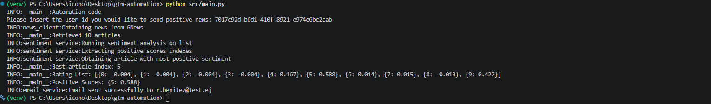

# API Automation

## Overview
This project implements a loyalty system. Given a user_id as input the application retrieves the user's preferred news category. This script searches for relevant news, evaluates article sentiment and selects the most positive article available. Finally, this is sent to the user by email.

## Project Structure
src/ 

├── main.py 

├── news_client.py 

├── sentiment_service.py 

├── email_service.py 

└── user_repository.py 

data/ 

├── user_data_sample.csv 

└── user_register_data_sample.csv 

.env.example 

.gitignore 

README.md 

requirements.txt 

## Requirements
- Python 3.11
- **GNews** API Key
- **API Ninjas** API Key
- Gmail account with configured App Password

## Setup and configuration
- Create virtual environment: `python -m venv venv` 
- Start Virtual environment: `venv/Scripts/activate`
- Install dependencies: `pip install -r requirements.txt`
- Create a .env file based on .env.example and configured required credentials: 

    `GNEWS_API_KEY=your_key`

    `NINJAS_API_KEY=your_key` 

    `EMAIL_HOST=smtp.gmail.com`

    `EMAIL_PORT=587 `

    `EMAIL_USER=your_email `

    `APP_PASSWORD=your_app_password `

## Usage
Execution: `python src/main.py` 

 Please insert the user_id you would like to send positive news: <insert_valid_user_id>

## Workflow
1. Receive `user_id`.
2. Retrieve the user's profile and preferences from the files.
3. Retrieve 10 articles from **GNews** using the user's preferred category.
4. Extract the article title and description for sentiment analysis.
5. Perform sentiment analysis using the **API Ninjas** Sentiment API.
6. Use a sentiment score threshold of `0.5` as a heuristic to favor articles with a stronger positive signal. Only articles with a score greater than or equal to `0.5` are considered.
7. Select the article with the highest positive sentiment score.
8. Send a personalized email containing the selected article to the user's email address.

## API Integrations

### GNews

Purpose: Retrieve news articles.

Endpoint: [GNews Search API](https://gnews.io/api/v4/search)

### API Ninjas

Purpose: Perform sentiment analysis.

Endpoint: [Sentiment API](https://api.api-ninjas.com/v1/sentiment)

### Gmail SMTP

Purpose: Send personalized emails to users.

## Limitations
- Sentiment analysis is used as a heuristic to identify positive news based on the language used in an article. However, a positive sentiment score does not necessarily mean that the article represents objectively positive or good news.
- The application processes a small CSV dataset, so Pandas was used for data processing. If the solution were scaled, alternatives such as PySpark could be considered.
- Application does not currently support badge execution.

## Example Output

  

